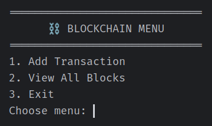
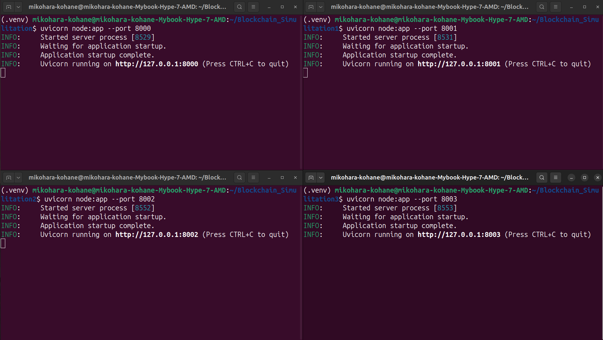
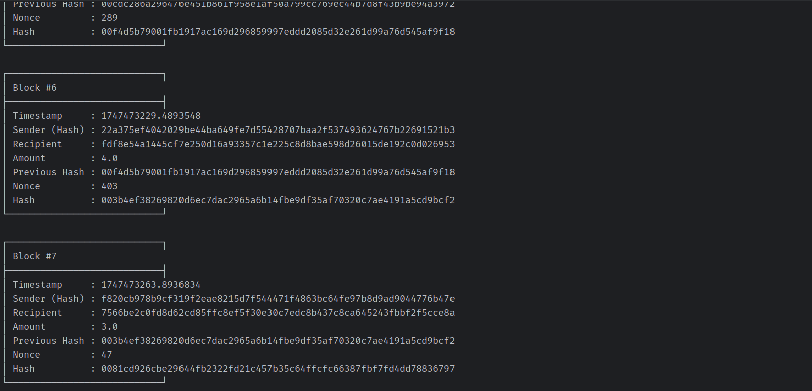
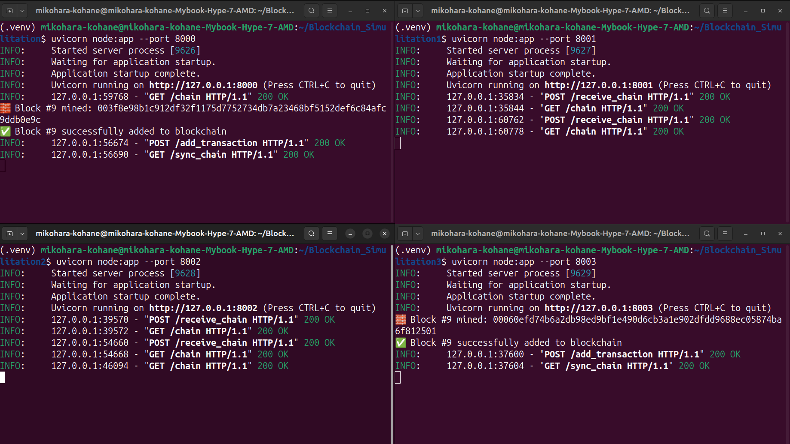

# 🧱⛓️‍💥 Blockchain Simulation

A simple blockchain simulation project that demonstrates the basic concepts of blockchain technology including blocks, mining, transactions, and peer-to-peer networking.

## 👀 Preview
#### Main Menu:



#### Distributed Blockchain:


#### Block Views:


#### Test Run:



## 🚀 Features

- ✅ Block creation with sender, recipient, amount, timestamp, and hash
- 🔐 SHA-256 hashing (with anonymized sender/recipient via hashed usernames)
- ⛏️ Proof-of-Work mining algorithm with configurable difficulty
- 🧱 Genesis block generation
- 🗃️ LevelDB integration for persistent storage (like Bitcoin's own design)
- 🔍 Blockchain validation & integrity check
- 📦 Fully CLI-based interaction — no frontend, no GUI

The blockchain utilizes LevelDB for data persistence, providing a lightweight and efficient key-value storage solution—similar to the mechanism used in Bitcoin's internal architecture.

## 📦 Tech Stack

- Python 3.10
- [LevelDB](https://github.com/google/leveldb) (via `plyvel` library)
- SHA-256 hashing (via Python's `hashlib`)
- JSON for block serialization

## 🔀 Project Structure

```
.
├── block.py           # Block class definition
├── blockchain.py      # Blockchain implementation with storage
├── config.py          # Configuration settings for nodes
├── main.py            # CLI interface for interacting with the blockchain
├── node.py            # FastAPI server for P2P communication
├── requirements.txt   # Project dependencies
└── transaction.py     # (Empty file, possibly for future use)
```

## ⬇️ Installation

1. Clone the repository:
```bash
git clone <repository-url>
cd Blockchain_Simulitation
```

2. Create and activate a virtual environment:
```bash
python -m venv .venv
.venv\Scripts\activate  # On Windows: 
source .venv/bin/activate  # On Linux: 

```

3. Install the required dependencies:
```bash
pip install -r requirements.txt
```

4. Make sure you have LevelDB installed on your system, as the project uses PlyveL which requires it:
   - On Ubuntu/Debian: `sudo apt-get install libleveldb-dev`
   - On macOS: `brew install leveldb`
   - On Windows: Follow [these instructions](https://github.com/simon-weber/leveldb-py)

## ❕ How To Use ❔

### Running a Blockchain Node

like blockchain in general, I made this blockchain simulation work in many nodes, but you run it on 1 device using a local host

1. #### Configure your node by modifying `config.py`:
   - Set `PORT` to the port you want your node to run on (e.g., 8000, 8001, 8002)
   - Update `PEERS` list with other nodes you want to connect to

2. #### Set Up Folder:
 
    if you want to run more than 1 node, then you must also copy the main folder. Because to run it must be different programs, but still connected using the API. the number of folders matches the number of nodes you want to run

3. #### Start a node:

    you must move to the directory to each program through each terminal as well and run the API according to the terminal
```bash
uvicorn node:app --port 8000 #in terminal 1
uvicorn node:app --port 8001 #in terminal 2
#and so on according to how many nodes you want
```

4. #### Run multiple nodes by changing the `PORT` in `config.py` and running `node.py` in different terminals.

### Using the Client

1. Make sure at least one node is running (default on port 8000).

2. Run the client interface:
```bash
python main.py
```

3. Use the interactive menu to:
   - Add transactions
   - View all blocks in the chain
   - Exit the application

## ☀️ Core Components

### Block (block.py)

The `Block` class represents a block in the blockchain with:
- Block index
- Timestamp
- Sender (hashed)
- Recipient
- Transaction amount
- Previous block hash
- Nonce for mining
- Current block hash

### Blockchain (blockchain.py)

The `Blockchain` class manages:
- Creating the genesis block
- Adding new blocks
- Validating the chain
- Persisting blocks to LevelDB
- Implementing consensus rules

### Node (node.py)

A FastAPI server that:
- Exposes endpoints for blockchain operations
- Communicates with peer nodes
- Broadcasts chain updates
- Implements chain synchronization

### Client (main.py)

A command-line interface for:
- Adding transactions to the blockchain
- Viewing the current state of the chain
- Interacting with nodes via API calls

## 🔐 Data Structure

```
{
  "index": 1,
  "timestamp": 1715861112.123,
  "sender": "hashed_sender",
  "recipient": "hashed_recipient",
  "amount": 100,
  "previous_hash": "0000abcd...",
  "nonce": 3123,
  "hash": "00003f..."
}
```

## 🧠 Technical Highlights

- Proof-of-Work: The block is mined by finding a nonce so that the hash starts with 00 (difficulty = 2).
- LevelDB: Blocks are persisted using LevelDB via plyvel.
- Hashing: SHA-256 used for:
- User identifiers (sender, recipient)
- Block integrity (calculate_hash)

## 🔚 API Endpoints

- `POST /add_transaction`: Add a new transaction to the blockchain
- `GET /chain`: Get the full blockchain data
- `POST /receive_chain`: Receive and process a chain from peers
- `GET /ping`: Check if a node is active
- `GET /sync_chain`: Synchronize with the longest valid chain in the network

## 🛅 Security Features

- Hashing of user identities
- Cryptographic linking of blocks
- Proof-of-work consensus mechanism
- Chain validation

## 📒 Notes

- This is a simulation for educational purposes and not suitable for production use
- The mining difficulty can be adjusted in the blockchain.py file` self.difficulty = 2 `
- Each node maintains its own copy of the blockchain
- To reset the blockchain: `rm -rf db/`
- You can test different nodes whether it runs smoothly by turning `API_URL = "http://127.0.0.1:8001"` in main.py into the port you want to test


## 📝 License

This project is licensed under the MIT License - see the [LICENSE](LICENSE) file for details.